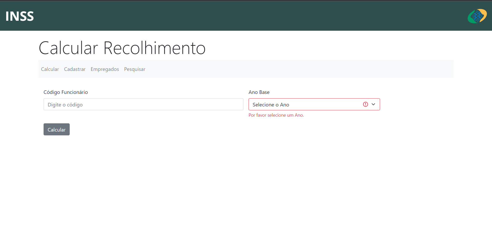
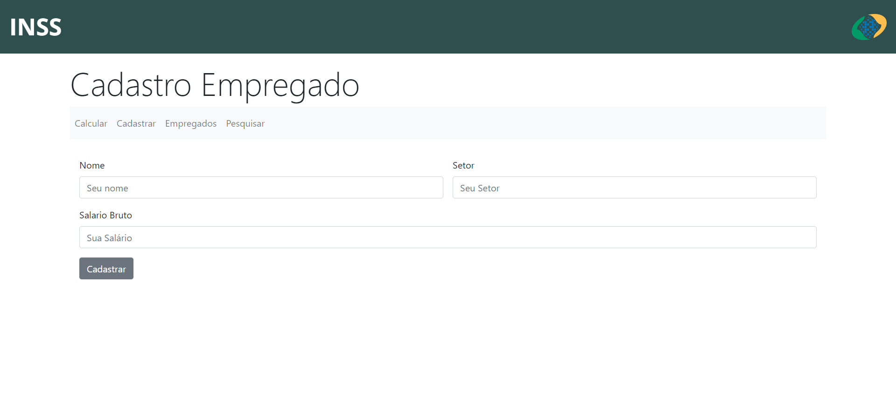
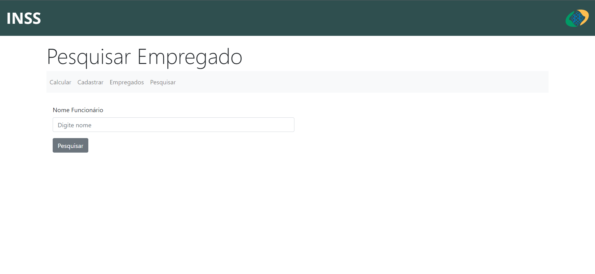
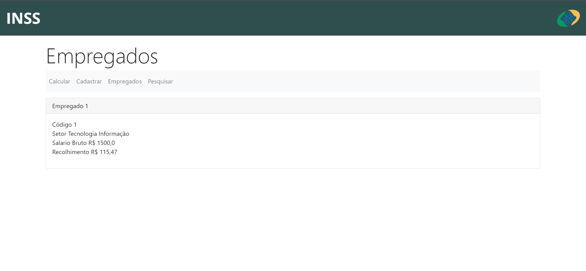

# Projeto Recolhimento INSS

  
  
  
  <a href="https://www.microsoft.com/pt-br/windows/?r=1" target="_blank" rel="noreferrer" rel="noopener">
  

 

> Esse projeto foi desenvolvido usando linguagem java e spring boot com padrao MVC, que tem como objetivo fazer o cálculo do recolhimento do INSS de empregados cadastrados no sistema;

## ⚙️ Funcionalidades

- [x] Empregados podem se cadastrar enviando os seguintes dados:
  - Nome
  - Setor
  - Salário Bruto 
  - [x] Visualizar todos os empregados cadastrados no sistema;
  - [x] Pesquisar empregados a partir de seu nome;
  - [x] Calcular o recolhimento do INSS a partir do Id do empregado;

## 💻 Preview

    
    

    
    

## 💻 Pré-requisitos

Antes de começar, verifique se você atendeu aos seguintes requisitos:

* Ter instalado a  linguagem `Java JDK 17 LTS`.
* Ter instalado a IDE `IntelliJIDEA` ou `Eclipse Spring`. 
* Ter uma máquina `Windows 10` ou `11`.

## ❤️ Apoio

Agradecemos a Fatec e ao Mestre Maromo por todo apoio e ensinamentos.

  

    <a href="https://fatecmm.edu.br" target="_blank" rel="noreferrer" rel="noopener">
       
    </a> 
  

 

[⬆ Voltar ao topo](#Projeto-Recolhimento-INSS) 
